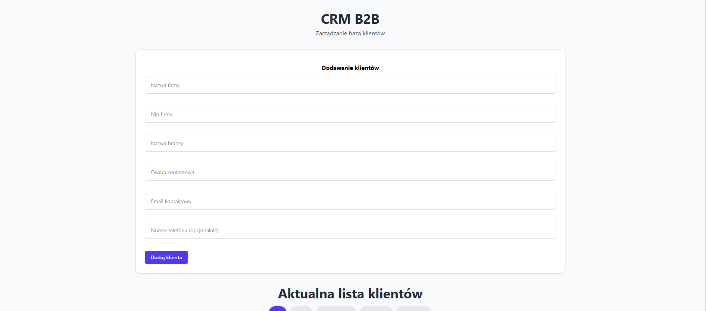
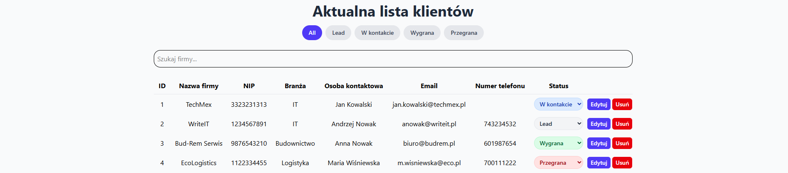

# CRM B2B

Educational project for managing database of clients (CRM), made for understand about React and API technologies.

## Look of application

How look application:

## Main functionalities
* **Customer management**: Add, edit and delete records in database.
* **Filtering and search**: Intuitive search companies by name, NIP, industry or e-mail.
* **Clients status**: Ability to update business status (e. g., Lead, W kontakcie, Wygrana, Przegrana).
* **Asynchronous state handling**: Implement mechanism `isLoading` with security `try..finally` for safe communication with API.

## Technologies Used
* **Frontend**: React, JavaScript, Tailwind CSS (folder: `/frontend`).
* **Backend**: Python, FastAPI, SQLAlchemy ORM (folder: `/backend`).
* **Database**: SQLite.
* **Communication**: REST API.

## Technical challenges
When I made project, I focused on:
* Correctly handling asynchronous requests to server
* Implementation of fault-tolerance patterns (try-catch-finally)
* Optimization of the user interface through clear management of loading states

## How to run 
1. **Clone the repository**: `git clone [link]`
2. **Backend**: Navigate to `backend`, install requirements(`pip install -r requirements.txt`) and run `python main.py`
3. **Frontend**: Navigate to `frontend`, run `npm install` and `npm start`

---
*Created by Wiktor Mazur*